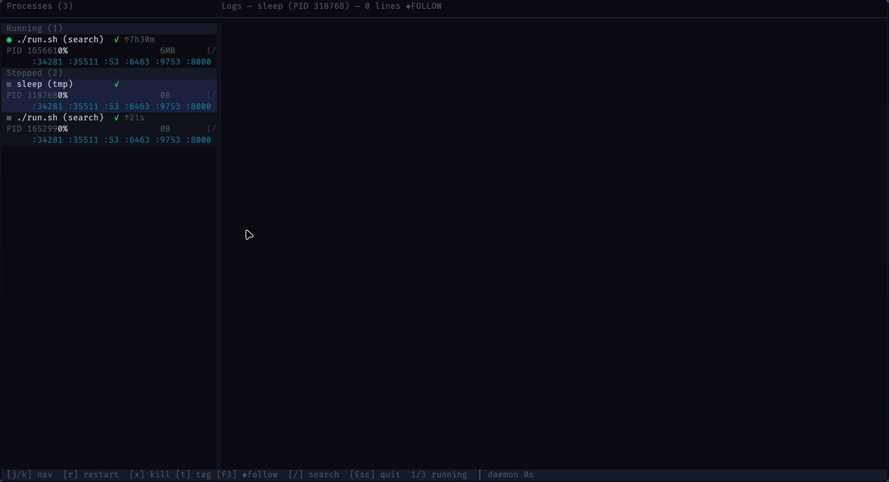

# MSO — process manager with a live TUI



Manage background processes from your terminal. Spawn, monitor, and control
long-running commands with a real-time dashboard.

```bash
curl -fsSL https://raw.githubusercontent.com/Abdallah4Z/mso/master/install.sh | bash
```

## Quick start

```bash
# Run a process
mso run -s 5 python3 -m http.server 8080

# Open the TUI (or just run `mso`)
mso view

# Print stats to the terminal
mso stats
```

## What makes MSO different

- **TUI dashboard** with live CPU/memory sparklines, grouped process list,
  searchable logs, mouse support, and resizable panels
- **Daemon-client** — processes survive your terminal closing. The background
  daemon owns them, restarts them on crash, and keeps their logs
- **Health checks** — HTTP health endpoint with auto-restart on failure
- **SQLite logs** — every line is timestamped and searchable, survives
  daemon restart
- **Prometheus metrics** at `127.0.0.1:9753/metrics`
- **UDS protocol** — bincode over Unix sockets, sub-millisecond messages

## Commands

| Command | What it does |
|---------|--------------|
| `mso run` | Run a supervised process |
| `mso view` | Open the TUI dashboard |
| `mso logs` | Export process logs as text or JSON |
| `mso stats` | Print process statistics |
| `mso prune` | Delete old log entries |
| `mso exec` | Run a command directly (no daemon) |
| `mso config` | Validate or show configuration |
| `mso completion` | Generate shell completions |

See [docs/commands.md](docs/commands.md) for the full reference.

## Install

```bash
# One command (any Linux)
curl -fsSL https://raw.githubusercontent.com/Abdallah4Z/mso/master/install.sh | bash

# From source
cargo install mso

# Bleeding edge
git clone https://github.com/Abdallah4Z/mso.git
cd mso
make install
```

Linux only. Requires `/proc` for telemetry.

## Data

```
~/.mso/
├── mso.sock          # daemon communication socket
├── daemon.pid
├── processes.json    # process metadata
├── logs.db           # SQLite log database
├── config.toml       # user configuration
└── presets/          # saved process presets
```

## License

MIT
