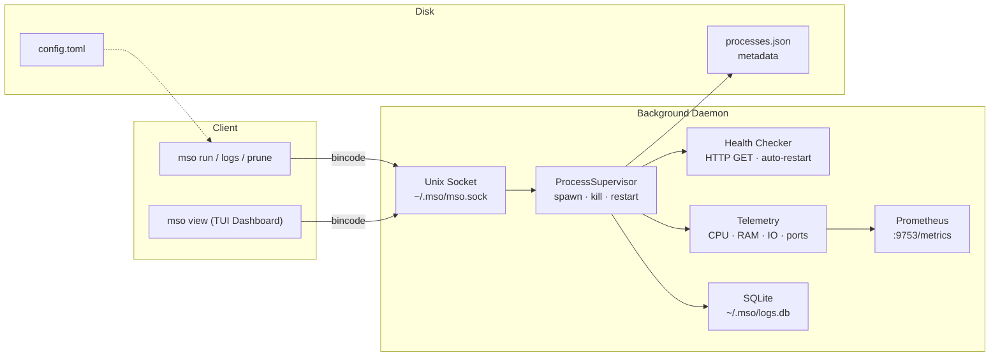

# MSO — Multi-Stream Orchestrator

**High-performance CLI process wrapper, daemon, and TUI dashboard.**

MSO is a process manager for developers who want to spawn, monitor, and control long-running processes from the terminal. Think of it as a lightweight, developer-friendly alternative to systemd/supervisord with a beautiful real-time TUI.

```
mso run --restart always --tag web -s 5 python3 -m http.server 8080
mso run --health-check http://localhost:8080/health nginx
mso                # open the interactive dashboard
```

## Features

- **Daemon-client architecture** — background daemon manages processes; CLI and TUI connect via Unix socket
- **Process lifecycle** — spawn, kill (SIGTERM → 2s → SIGKILL), restart, auto-restart on crash
- **Real-time TUI dashboard** — neon/dark/light themes, mouse-supported, resizable panels, sparkline CPU/MEM history
- **Per-process metrics** — CPU%, memory, I/O bytes, open ports, uptime
- **SQLite log persistence** — every log line is timestamped and stored; survives daemon restart
- **Log search & export** — keyword search with stream filter (stdout/stderr), export to text or JSON
- **ANSI color passthrough** — ANSI escape codes in process output render as actual colors in the TUI
- **Auto-follow log mode** — `F3` toggles auto-scroll to newest log lines
- **Health checks** — HTTP health check endpoint with configurable interval, timeout, and max failures
- **Process tagging** — tag processes and filter by tag in the TUI
- **Prometheus metrics** — HTTP endpoint at `127.0.0.1:9753/metrics`
- **Process presets** — `--preset <name>` loads saved process configurations
- **Config validation** — `mso config validate` checks your configuration
- **TUI themes** — Neon, Dark, and Light themes; configurable in `config.toml`
- **Read-only mode** — `mso view --readonly` for safe monitoring
- **Process list search** — press `f` to filter processes by name/tag/PID
- **Process reordering** — `Ctrl+↑`/`Ctrl+↓` to reorder processes in the list
- **Notification center** — press `N` to view recent events (crashes, health failures, restarts)
- **`mso stats`** — print process statistics to the terminal
- **Kill confirmation** — press `x` asks for confirmation before killing
- **Graceful shutdown** — SIGTERM/SIGINT cascade: SIGTERM children → 3s → SIGKILL survivors
- **Log retention** — auto-prune logs older than `log_retention_days` (default 30)
- **Shell completions** — `mso completion bash|zsh|fish|powershell|elvish`
- **Autosave** — process table persisted every 30 seconds automatically

## Installation

### Pre-built binary
```bash
curl -fsSL https://github.com/Abdallah4Z/mso/releases/latest/download/mso-x86_64-unknown-linux-gnu -o /usr/local/bin/mso && chmod +x /usr/local/bin/mso
```

### From source (Rust 1.80+)
```bash
cargo install mso
```

### From source (bleeding edge)
```bash
git clone https://github.com/Abdallah4Z/mso.git
cd mso
cargo install --path .
```

Requires Rust 1.80+ and Linux (uses `/proc` for process telemetry).

## Quick Start

```bash
# Start a long-running process
mso run -s 5 python3 -m http.server 8080

# Start with auto-restart and tags
mso run --restart always --tag web --tag prod -s 0 node server.js

# Open the dashboard
mso

# View logs
mso logs <pid-or-uuid> --tail 50

# Print process stats
mso stats
```

**Note:** All flags (`--restart`, `--tag`, `--health-check`, etc.) must come **before** the command. Everything after the command name is treated as the command and its arguments.

```bash
# ✅ Correct
mso run --restart always -s 0 echo hello

# ❌ Wrong — flags consumed as command args
mso run echo hello --restart always
```

## Usage

### `mso run` — Run a supervised process

```
mso run [OPTIONS] <COMMAND...>

Options:
  -s, --silence [<SECS>]     Seconds to stream output before backgrounding (0 = immediate)
      --restart <POLICY>     Auto-restart policy: "no" (default) or "always"
      --tag <TAG>            Tag for filtering (can be specified multiple times)
      --health-check <URL>   Health check URL (e.g. http://localhost:8080/health)
      --health-interval <S>  Health check interval in seconds (default: 10)
      --health-timeout <S>   Health check timeout in seconds (default: 5)
      --health-max-failures  Max failures before restart (default: 3)
      --alert-webhook <URL>  Webhook URL for exit/crash notifications
      --preset <NAME>        Load preset configuration
      --depends-on <UUID>    Wait for dependency to be healthy before starting (can repeat)
```

### `mso view` — Open the TUI dashboard

The default command if no subcommand is given. Shows all managed processes with live metrics, logs, and controls.

**Key bindings:**

| Key | Action |
|-----|--------|
| `j` / `k` or `↑` / `↓` | Navigate process list |
| `Enter` or `i` | Open detail card |
| `r` | Restart selected process |
| `x` or `Backspace` | Kill selected process |
| `g` / `G` | Go to first / last process |
| `/` | Enter log search mode |
| `n` / `N` | Next / previous search match |
| `F1` / `F2` | Filter logs by stdout / stderr |
| `t` | Toggle tag filter overlay |
| `Esc` | Close overlay / exit search / quit |
| `PgUp` / `PgDn` | Scroll log view |
| Mouse click | Select process |
| Mouse drag on border | Resize sidebar |
| Scroll wheel | Scroll logs |

### `mso exec` — Run a command directly

```
mso exec <COMMAND...>
```

Runs a command with inherited stdio and exits with its exit code. No daemon involved. Useful for CI/CD scripts.

### `mso config` — Manage configuration

```
mso config <ACTION>
```

| Action | Description |
|--------|-------------|
| `validate` | Check `~/.mso/config.toml` for errors |
| `show` | Print the current configuration |
| `path` | Show the config file path |

### `mso preset` — Manage process presets

```
mso preset <ACTION> [--name NAME] [--command...]
```

| Action | Description |
|--------|-------------|
| `list` | List saved presets |
| `save --name <NAME> -- <COMMAND>` | Save a preset |
| `remove --name <NAME>` | Remove a preset |

Presets are stored in `~/.mso/presets/*.toml`.

### `mso logs` — Export logs

```
mso logs <PID-or-UUID> [--format text|json] [--tail N]
```

Connects to the daemon and exports log lines for a process. Partial UUID matching works (first 8 characters).

### `mso prune` — Prune old logs

```
mso prune [--days N] [--process UUID]
```

Deletes log entries older than N days. Default: 30 days. Optionally target a specific process.

### `mso completion` — Generate shell completions

```
mso completion bash|zsh|fish|powershell|elvish
```

### `mso stats` — Process statistics

```
mso stats [--format text|json]
```

Prints a table of all managed processes with PID, name, CPU, memory, ports, and status.

### `mso systemd` — Systemd service management

```
mso systemd install|uninstall|status
```

Installs a systemd user service for automatic daemon startup on login.

### `mso connect` — Remote daemon

```
mso connect <user@host> [--socket PATH]
```

Establishes an SSH tunnel to a remote MSO daemon and opens the TUI connected to it.

## Configuration

MSO reads `~/.mso/config.toml` if it exists:

```toml
restart_policy = "always"
silence_secs = 5
log_retention_days = 90

[theme]
accent = "#00CCFF"
bg_dark = "#0A0A10"
```

CLI flags override config file values.

## Data & State

All MSO data lives in `~/.mso/`:

| File | Description |
|------|-------------|
| `mso.sock` | Unix domain socket for daemon communication |
| `daemon.pid` | Daemon process ID |
| `daemon.log` | Daemon stderr/stdout log |
| `processes.json` | Process metadata (command, status, tags, restart policy, etc.) |
| `logs.db` | SQLite database with all process log lines |
| `config.toml` | User configuration |

## Performance

| Metric | Value |
|--------|-------|
| **Release binary size** | **5.0 MB** (stripped, LTO, ~11,700 LOC) |
| **Daemon idle RAM** | **6.8 MB RSS** |
| **Daemon idle CPU** | **0.0%** |
| **Tests** | **30** (17 unit + 4 integration + 4 snapshot + 5 supervisor) |
| **Clippy warnings** | **0** |
| Encode protocol message | ~2–3 µs |
| Decode protocol message | ~2 µs |
| SQLite write (single log line) | ~0.6 µs |
| SQLite query (100 lines from 1000) | ~66 µs |
| Sparkline render (12 chars) | ~216 ns |
| TUI refresh interval | 500 ms |

## Architecture



```
~/.mso/
├── mso.sock          # Unix domain socket
├── daemon.pid        # Daemon PID
├── daemon.log        # Daemon output
├── processes.json    # Process metadata
├── logs.db           # SQLite log database
├── config.toml       # User configuration
└── presets/          # Saved process presets
```

## Project Structure

```
src/
├── main.rs              # CLI entry point — dispatch to commands
├── lib.rs               # Library crate for integration tests
├── cli.rs               # Clap command definitions
├── protocol.rs          # Wire format, messages, shared types
├── util.rs              # Paths, config, helpers
├── ring_buffer.rs       # Bounded VecDeque (legacy)
├── client/
│   ├── runner.rs        # Register process, stream logs from daemon
│   ├── daemonize.rs     # Ensure daemon is running, connect to socket
│   └── remote.rs        # SSH tunnel for remote daemon connection
├── daemon/
│   ├── mod.rs           # Daemon startup, signal handlers
│   ├── listener.rs      # UDS accept loop, message dispatch
│   ├── supervisor.rs    # Spawn, kill, restart, health checker
│   ├── persist.rs       # JSON process metadata persistence
│   ├── telemetry.rs     # CPU/RAM/IO/sparkline from /proc
│   ├── signal.rs        # kill/force_kill/is_alive helpers
│   ├── log_db.rs        # SQLite log database
│   ├── prometheus.rs    # Prometheus /metrics HTTP endpoint
│   ├── state.rs         # ProcessTable (Arc<DashMap>)
│   └── alerter.rs       # Webhook alert sender
└── tui/
    ├── mod.rs           # Terminal init, event loop
    ├── app.rs           # Application state, key/mouse handlers
    ├── ui.rs            # Layout (sidebar + log pane + status bar)
    ├── theme.rs         # Neon color palette, scrollbar, helpers
    ├── event.rs         # TuiEvent re-exports
    └── widgets/
        ├── mod.rs
        ├── process_list.rs  # Grouped process list with metrics
        ├── log_view.rs      # Timestamped log viewer with search
        ├── status_bar.rs    # Status bar with toasts
        └── detail_pane.rs   # Process detail card overlay
```

## License

MIT
