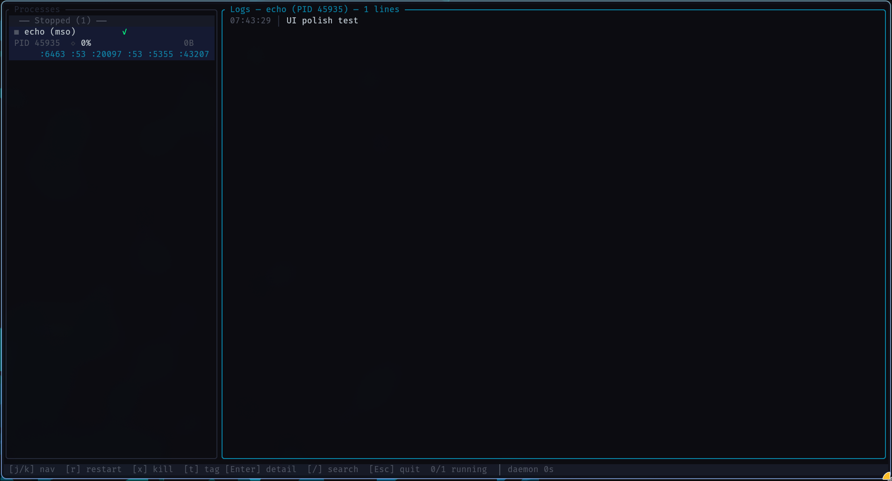
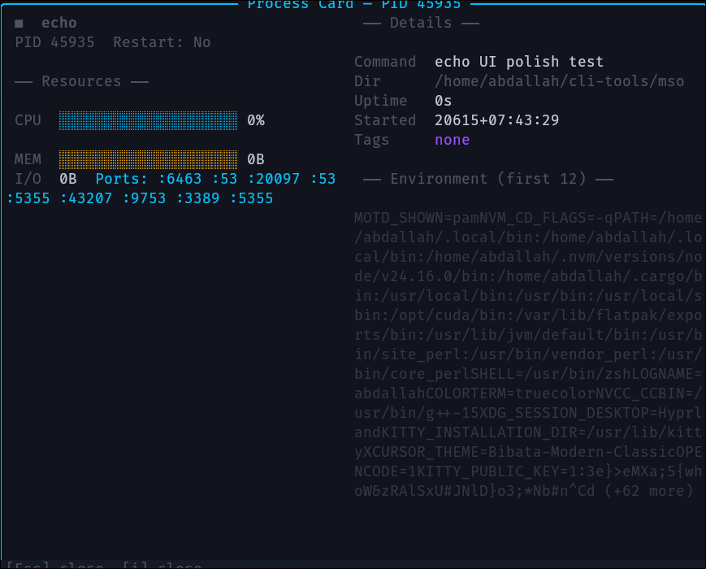

# TUI Dashboard

The MSO TUI dashboard provides a real-time view of all managed processes with live metrics, searchable logs, and interactive controls.

## Opening the Dashboard

```bash
mso
# or
mso view
```

The dashboard opens in an alternate screen buffer. Press `Esc` to exit.

## Layout



| Area | Description |
|------|-------------|
| **Sidebar (left)** | Grouped process list with status icons, names, tags, resource bars, sparklines, and ports |
| **Log pane (right)** | Timestamped, color-coded log viewer with scrollbar and search overlay |
| **Status bar (bottom)** | Key hints, running/total count, daemon uptime, toast notifications |

## Process List

Processes are grouped by status:

- **Running** (`◉` green) — actively running
- **Sleeping** (`○` yellow) — idle/sleeping
- **Crashed** (`✕` red) — exited with non-zero status
- **Stopped** (`■` gray) — exited cleanly or killed

Each process entry shows:

```
◉ bash (project)  ✓ ↑12m                ← icon + name(dir) + health + uptime
 PID 277760  ◇  23% ▁▂▃▅▇▇█  42.5MB    ← PID + CPU% + sparkline + memory
              :8080                     ← ports (if any)
```

## Log Viewer

Log lines are timestamped and color-coded:

| Color | Pattern |
|-------|---------|
| Red | `ERROR`, `error` |
| Yellow | `WARN`, `warn` |
| Green | `INFO`, `info` |
| Gray | `DEBUG`, `debug` |
| White | Everything else |

**ANSI color passthrough:** ANSI escape codes from process output are rendered as actual colors, bold, and dim styles in the log view. Supported: standard 16 colors, 256-color palette, bold, and dim modifiers.

**Auto-follow mode:** Press `F3` to toggle between `◆FOLLOW` (auto-scrolls to newest lines) and `◇PAUSED` (manual scroll). Resets to FOLLOW when switching processes.

Lines are prefixed with `[HH:MM:SS] │ ` for readability.

## Themes

MSO ships with three TUI themes:

| Theme | Description |
|-------|-------------|
| **Neon** (default) | Dark backgrounds with cyan/green/red accents |
| **Dark** | Pure black background, muted colors |
| **Light** | Light background with blue/red accents |

The theme is selected via `~/.mso/config.toml`:

```toml
[theme]
accent = "#00CCFF"
bg_dark = "#0A0A10"
```

## Search Mode

Press `/` to enter search mode. A search bar appears at the bottom of the log pane:

```
/ search query (3/42) [stdout]
```

- Type your query — results are fetched from the SQLite database
- `Enter` to execute the search
- `n` / `N` to cycle through matches
- `F1` to toggle stdout filter
- `F2` to toggle stderr filter
- `Esc` to exit search

## Detail Card



Press `Enter` or `i` on a selected process to open the detail card — a centered overlay with:

**Left column:** Identity (icon + name + PID + restart policy) and Resources (CPU bar + sparkline, memory bar, I/O, ports)

**Right column:** Details (full command, working directory, uptime, started time, tags) and Environment variables (first 12)

## Tag Filtering

Press `t` to enter tag filter mode. A number list of available tags is shown:

```
[0] Clear filter
[1] web
[2] prod
```

Press the corresponding number to filter. The status bar shows the active filter: `tag: web`. Press `t` again or `Esc` to clear.

## Read-Only Mode

Launch with `mso view --readonly` to disable restart and kill actions. The status bar shows a `[READONLY]` badge. Useful for production monitoring where you want to prevent accidental keystrokes.

## Notification Center

Press `N` to open the notification panel. It shows the last 100 events: process crashes (red), restarts (green), health check failures (yellow), exits (gray), and error log lines. Press `Esc` or `N` again to close.

## Resizable Sidebar

Drag the vertical `░` divider between the sidebar and log pane with your mouse to resize. The sidebar width is clamped between 30 and 60 characters.

## Toast Notifications

When you press `r` (restart) or `x` (kill), a green toast notification appears on the right side of the status bar:

```
 Restarting PID 277760
```

The toast auto-clears after 2 seconds.

## Keyboard Reference

| Key | Context | Action |
|-----|---------|--------|
| `j` / `↓` | Process list | Select next process |
| `k` / `↑` | Process list | Select previous process |
| `f` | Process list | Filter processes by name/tag/PID |
| `g` | Process list | Go to first process |
| `G` | Process list | Go to last process |
| `Enter` / `i` | Process list | Open detail card |
| `r` | Process list | Restart selected process (disabled in read-only) |
| `x` / `Backspace` | Process list | Kill selected process (disabled in read-only) |
| `t` | Process list | Toggle tag filter overlay |
| `Ctrl+↑` / `Ctrl+↓` | Process list | Reorder processes |
| `N` | Any | Toggle notification center
| `PgUp` | Log view | Scroll up 20 lines |
| `PgDn` | Log view | Scroll down 20 lines |
| `/` | Log view | Enter search mode |
| `n` | Search active | Next match |
| `N` | Search active | Previous match |
| `F1` | Search active | Toggle stdout filter |
| `F2` | Search active | Toggle stderr filter |
| `F3` | Log view | Toggle auto-follow mode (`◆FOLLOW` / `◇PAUSED`) |
| `Esc` | Any | Close overlay / exit search / quit |
| `Ctrl+C` / `Ctrl+Q` | Any | Force quit |

## Mouse Reference

| Action | Context | Result |
|--------|---------|--------|
| Left click | Process list | Select process |
| Left click + drag | Sidebar border | Resize sidebar width |
| Scroll up | Log view | Scroll up |
| Scroll down | Log view | Scroll down |

## Empty State

When no processes exist, the sidebar shows:

```
┌─ Processes ─────────────────┐
│                              │
│      No processes            │
│                              │
│   Run `mso run <cmd>`       │
│   to get started             │
│                              │
└──────────────────────────────┘
```
